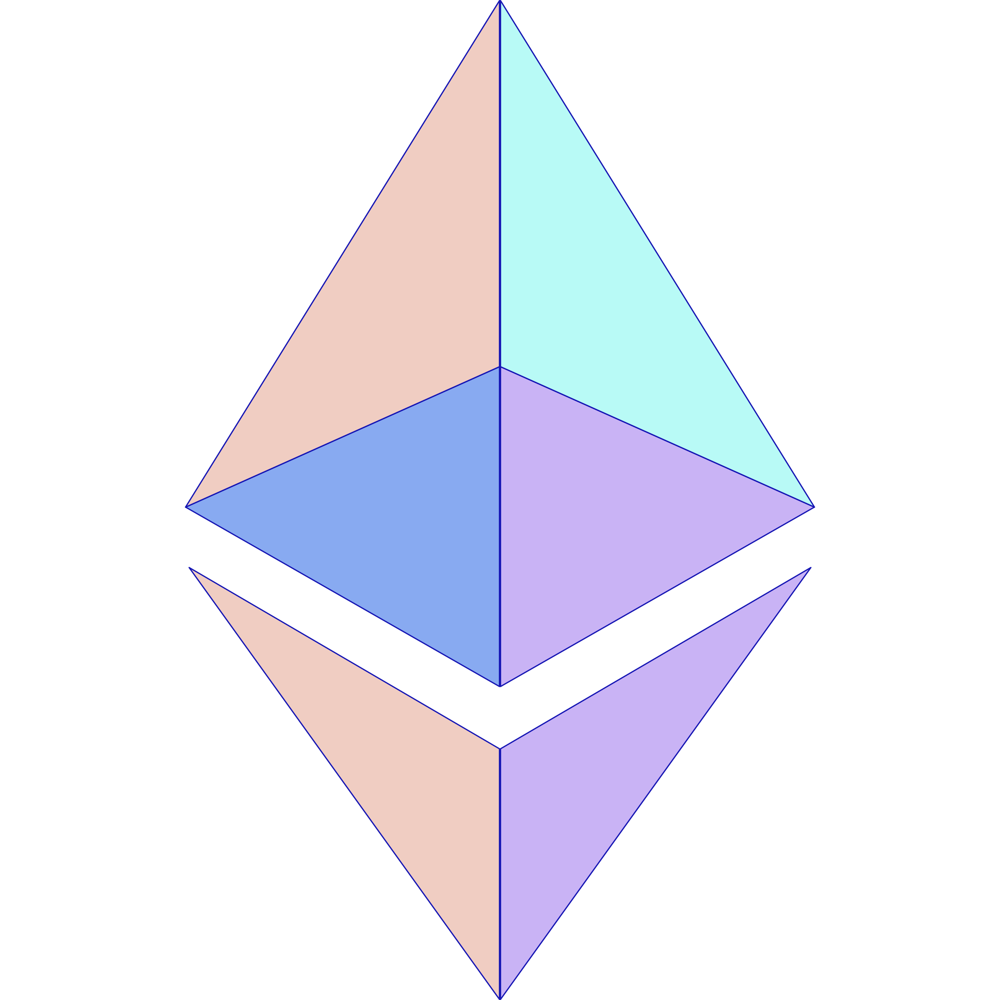

<p align="center">
  <br />
  
  <br/>
  <br />
  <p align="center">


</p>

<br/>

[](#table-of-contents)

<br/>

## • Links

[](https://eth-dapp-three.vercel.app/)


## • Overview

This is dapp that you can send message and wave to the board. Also, if you're lucky, you can receive token(testnet token) from this contract.

This app is deployed to [here](https://eth-dapp-three.vercel.app/).

## • Launch

1. run `yarn install` in terminal.

2. make `.env` file under `packages/contract` and input your `Private Key` and `Alchemy HTTP Key` like below.

```
PRIVATE_KEY = <YOUR_PRIVATE_KEY>
STAGING_ALCHEMY_KEY = <ALCHEMY_HTTP_KEY>
```

3. run `yarn contract deploy` in terminal. The result would be like below.

```
Deploying contracts with account:  0x04CD057E4bAD766361348F26E847B546cBBc7946
Account balance:  272899657284590565
WavePortal address:  0x40aB7863b1b4987Df1e514cD99791d523AA128A4
```

4. Finally, run `yarn client start` in terminal and see how it works!